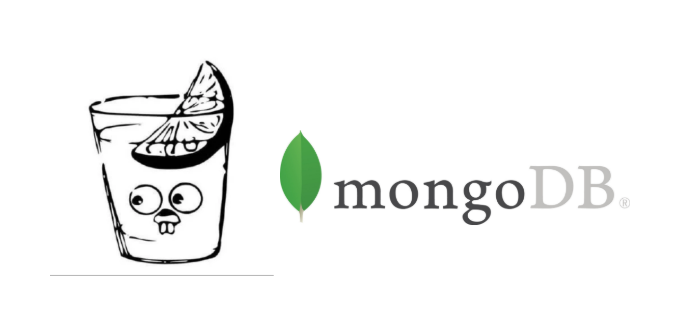

# Gin MongoDB Starter

A very lightweight [Gin-Gonic](https://github.com/gin-gonic/gin) and [MongoDB](https://www.mongodb.com/) starter 

## Developing locally

1. Clone
2. Run `make install`
3. Create an `.env` file from `.env.example`.
4. Run `go run main.go`

## Building an Image

1. Update image name in Makefile `image`
2. Run `make image`
